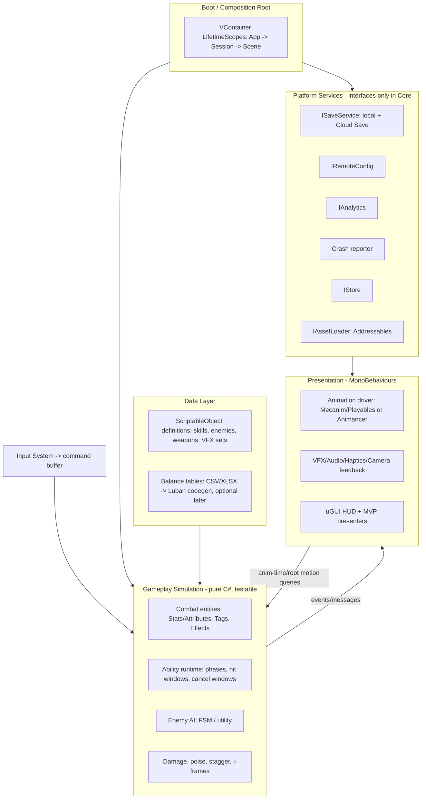

# G4 — Target Unity Architecture & Tech Stack for TTK (mobile-first xianxia real-time action)

Research date: 2026-09-26. Scope: global web research (EN/CN/JA). This is evidence input, not repository authority. Quotes are 15 words or fewer.

## 0. Starting point (read-only look at the repo)

- Editor `6000.3.21f1` (Unity 6.3 LTS line).
- `Packages/manifest.json` has only: Input System 1.11.2, Test Framework 1.4.5, uGUI 2.0.0, Netcode for GameObjects 2.2.0, Transport 2.4.0, plus physics/animation/particle/audio modules. There is **no URP package**, so the project is on the **Built-in Render Pipeline (BiRP)**. There is also no Addressables, Localization, DI, async or services package.
- `Assets/_Project/` has these folders: Core, Diagnostics, Editor, Gameplay, Input, Materials, Prefabs, Presentation, Resources, Scenes, Shaders, Tests.
- About 116 `.cs` files and 5 `.asmdef` files. The codebase is still small, so migrating now is cheap.

**Headline finding:** the most time-sensitive architectural debt is **BiRP**. Unity is deprecating it (details in §1), and every month of custom BiRP shader and post-processing work makes the move to URP more expensive.

---

## 1. Rendering

**Facts**
- Unity's 2026 render-pipeline strategy marks BiRP deprecated in **Unity 6.5** and keeps it "available in the Unity 6.7 LTS version", with support "at least until the end of 2028". It also says "no new features are planned for HDRP". URP is the focus, including "on-tile post-processing for mobile devices". [unity.com strategy]
- The Unity manual now says: "The Built-In Render Pipeline is deprecated and will be made obsolete". The Render Pipeline Converter handles built-in materials and quality settings automatically. **Custom shaders and particle shaders need manual rewrites.** [Unity manual, BiRP→URP]
- Unity 6.3 LTS changes for URP:
  - URP and HDRP now share one Render Graph compiler.
  - The Render Graph Viewer can connect to player builds on mobile devices.
  - URP Bloom adds mobile Kawase and Dual filtering. [Unity 6.3 What's New]
- Toon shader options:
  - **Unity Toon Shader** (`com.unity.toonshader`) is at **0.14.1-preview** (Apr 2026). It needs Unity 6.0 or later and supports URP Forward+. It is still *preview*. [UTS changelog]
  - **lilToon** is MIT-licensed and runs on URP in Unity 6. It is avatar/VR oriented and feature-heavy. [lilToon GitHub, discussions]
  - Chinese "仿原神" (Genshin-like) URP breakdowns describe the reference technique: ramp-texture two-tone shadows, per-part maps (Body/Face/Hair), and SDF face shadows. [知乎 670601962, 511150017; GitHub GenshinCelShaderURP]

**Recommendation**
- Migrate to **URP (the version bundled with 6000.3; pin the exact version when you adopt it)** as the first architecture task.
  - Use the **Forward+** or Forward renderer.
  - Build 2–3 **URP Asset quality tiers** (Low / Mid / High).
  - Enable the SRP Batcher and use GPU Resident Drawer only if profiling shows a benefit.
  - Post-processing stays minimal on mobile: tonemapping, color grading and cheap bloom.
- For toon/anime rendering, write **your own small ramp-based toon shader** in Shader Graph or HLSL, following the 知乎 Genshin-style breakdowns. Use UTS or lilToon as *reference implementations*, not as runtime dependencies. UTS is still preview, lilToon is heavy for mobile, and a custom shader keeps control over mobile variant count.
- Rewrite everything in `Assets/_Project/Shaders` for URP during the migration.

---

## 2. Code architecture

### 2.1 Layer diagram

**Dependency rules (enforce them with asmdefs)**
- `TTK.Core` holds interfaces, IDs and utilities, and references nothing game-specific.
- `TTK.Gameplay` references only Core.
- `TTK.Presentation` references Gameplay and Core.
- `TTK.Services.*` implements the Core interfaces.
- `TTK.Boot` wires everything together.
- `TTK.Editor` and `TTK.Tests.*` are separate assemblies.
- Boss Room uses the same pattern, described as "domain-based assembly architecture". [Boss Room GitHub]

### 2.2 Component choices

| Concern | Recommended | Why / evidence | Avoid |
|---|---|---|---|
| Folder layout | Feature/domain folders under `_Project` (already close), one asmdef per layer | Faster compile, enforced boundaries, and AI agents get clear edit zones | 30+ micro-asmdefs |
| DI | **VContainer** (MIT), used only at the composition root and for services | "5-10x faster than Zenject", reflection only at build stage; CyberAgent uses `LifetimeScope`-based VContainer [VContainer docs; CyberAgent blog] | Zenject/Extenject (heavier scene-start cost), injecting every View |
| Async | **UniTask** (MIT) | Allocation-free async/await [Cysharp] | Coroutine sprawl for loading/services |
| Reactive | **R3** (MIT), *optional*, UI bindings only | Modern Rx from Cysharp [OpenUPM] | Rx inside the combat hot path |
| Events | Typed C# events or a small typed message bus; SO event channels for designer-wired cues | Chop Chop demonstrates SO event channels [open-project-1] | A global string-keyed event bus |
| UI pattern | MVP: Presenter (plain C#) + View (MonoBehaviour) | Testable, AI-friendly | Full MVVM framework |
| State machines | Hand-written FSM for player/enemy/game flow; HFSM only where needed | Enough for action combat | Visual-scripting FSM assets |
| Ability system | **Custom, small, GAS-inspired** (Attributes, GameplayTags, Effects/Modifiers, Ability phases) defined in SOs | Several open GAS ports exist (GASify, sjai013, h2v9696) and Boss Room has an action system. Use them as references, not dependencies [GitHub] | Importing a full GAS port wholesale |
| Pooling | `UnityEngine.Pool.ObjectPool<T>` for projectiles, VFX, damage numbers | Built in, zero dependency | Custom pooling framework |
| Serialization | JSON (Newtonsoft via UPM) for saves; MemoryPack (MIT) only if save size or performance needs it | [Cysharp MemoryPack] | BinaryFormatter |

### 2.3 Data-driven design

- **ScriptableObjects** hold authored content with asset references: skills, enemy archetypes, VFX/audio cue sets, hit-reaction profiles.
- **Tables** hold numeric balance: level curves, cultivation realms, drop tables, economy. The CN standard is **Luban** (MIT).
  - Inputs: Excel, CSV and JSON.
  - It generates C# code, validates references and resource paths, and exports binary or JSON. [Luban GitHub]
  - v5 adds "AI Native" agent-skill and schema support, which suits an AI-agent workflow.
- Recommendation: start with SOs plus CSV. Adopt Luban once there are roughly 10 or more balance tables, or when non-programmers or agents edit numbers heavily. Text tables diff cleanly in Git and are easier for agents to edit safely than SO YAML.

---

## 3. Content, asset management, hot update, build size

**Facts**
- Google Play limits the base module to 200 MB.
- Play Asset Delivery (PAD) packs:
  - one install-time pack of up to 1 GB;
  - fast-follow and on-demand packs of up to 512 MB each;
  - at most 2 GB total across up to 50 packs. [Play Console help / community summaries]
- Unity 6 includes **Addressables for Android** (`com.unity.addressables.android` 1.0.x), which "provides Play Asset Delivery support for Addressables". It packs Addressables groups into asset packs when you build an AAB. [Unity manual]
- **YooAsset** (tuyoogame) is:
  - used in games with millions of DAU;
  - built on reference-counted unloading;
  - equipped with version rollback and gray (staged) release;
  - popular in CN, where studios often move off Addressables for more control. [YooAsset GitHub; CSDN; liuocean blog]
  - I found no first-party PAD integration for it.
- **HybridCLR** (MIT):
  - supports 6000.x;
  - is used by "thousands of commercial game projects" (its own claim);
  - is the CN standard for C# hot updates. [HybridCLR GitHub]
- Google Play policy says an app "may not download executable code… from a source other than Google Play". There is an exception for code running in "a virtual machine or an interpreter" [Play Device & Network Abuse policy]. HybridCLR's interpreter mode is widely shipped. For a Western/SEA-focused solo release, treat it as a **policy-interpretation risk**. iOS reviews (4.3 / 2.5.2) are an additional risk. [CSDN iOS 4.3]
- UGS Cloud Content Delivery gives 50 GB/month of free bandwidth. [UGS pricing]

**Recommendation**
- Use **Addressables + Addressables for Android (PAD)** as the official path.
  - Keep the base AAB well under 200 MB.
  - Put the first chapter in install-time assets.
  - Deliver later regions as fast-follow or on-demand packs.
- Use **Remote Config** plus data tables for live tuning. Most LiveOps changes are data, not code.
- **Do not adopt HybridCLR or YooAsset now.** Revisit them only if (a) code hot-fix cadence becomes a real bottleneck after launch, or (b) you target CN or mini-game platforms.

---

## 4. Animation

**Facts**
- **Animancer** lets scripts control animation directly, without Animator Controllers, and adds per-clip time events. It works alongside Unity's own Animation Events. [kybernetik.com.au docs]
- Animancer Lite is free, but only in the Editor. **Animancer Pro v8 costs $90** (v8.2.3). [Asset Store / itch]

**Recommendation for action combat**
- Put gameplay timing (hit windows, cancel windows, i-frames, super-armor) in **ability data, measured in normalized time**. The simulation reads animation time; it does not rely on fire-and-forget `AnimationEvent`s, which are brittle under blending and frame drops.
- Keep AnimationEvents only for cosmetic cues such as footsteps and whooshes.
- Driver options:
  - **Zero cost:** Mecanim for locomotion blend trees, plus Playables or `CrossFade` for attacks.
  - **Paid:** **Animancer Pro** for faster iteration on combo-heavy characters. This is an explicit purchase decision. The client's "zero-incremental-purchase" policy governs it.
- Root motion: use it for attacks and dashes, clamped by gameplay (capsule collision, lock-on steering). Locomotion stays code-driven for responsive mobile control.
- **Timeline:** use it for ultimate-skill cinematics and cutscenes only, not for ordinary attacks.

---

## 5. UI, localization, fonts

**Facts**
- The Unity manual lists **uGUI as the recommended runtime UI** and UI Toolkit as the alternative. [Unity manual, UI comparison]
- Dragon Crashers is Unity's UI Toolkit sample, updated for Unity 6. It demonstrates data binding, the Localization package, SafeArea handling and portrait/landscape support. [Unity Discussions / Asset Store]
- TextMeshPro fallback font assets:
  - They handle multi-script text.
  - Vietnamese is best handled with a **separate fallback asset containing only the characters missing from the base set**.
  - Fallbacks share the root font's line height, which matters for Vietnamese stacked diacritics. [TMP docs; killertee blog]

**Recommendation**
- Build the combat HUD in **uGUI + TMP** (TMP ships inside uGUI 2.0 in Unity 6). This gives animation-clip support and familiar tooling.
- Menus can stay uGUI for one-system simplicity. Move them to UI Toolkit later only if data-heavy screens (inventory, cultivation trees) become painful.
- Add the **Unity Localization** package early. Source language is VI; add EN and ZH later.
- Fonts:
  - Pick a Vietnamese-complete primary font with static atlas characters.
  - Use dynamic CJK fallback fonts for Chinese/xianxia terms.
  - Test with stacked diacritics (e.g. "Tiểu Tiên Ký").
- Wrap the HUD root in a SafeArea component.

---

## 6. Services & backend (solo-dev fit)

| Need | Recommended | Cost / notes |
|---|---|---|
| Crash reporting | **Firebase Crashlytics** (Unity SDK 8.6.1+ reports IL2CPP/NDK crashes; upload symbols) | Free. ANRs are reported on Android 11+, on the next run. Alternative: **Sentry**, which captures engine-level crashes before Unity starts and has richer context; it has a free tier. [Firebase docs; Sentry docs] |
| Analytics | Firebase Analytics or **UGS Analytics** (50k MAU free, 500 custom events/MAU) | Pick one and define a tracking plan before instrumenting. [UGS pricing] |
| Remote config / A-B | **UGS Remote Config** (no charge) or Firebase Remote Config | [UGS pricing] |
| Auth + cloud save | **UGS Authentication** (free) + **Cloud Save** (5 GiB storage, 1M reads + 1M writes/month free) | Local-first save with a version field and migration; cloud save as sync. [UGS pricing] |
| Server logic | UGS Cloud Code (1M invocations and 20 compute hours free) only for economy validation | [UGS pricing] |
| IAP | **Unity IAP 5.x**. 5.0.0 shipped Aug 2025 with Play Billing Library 8, so pre-5 versions are non-compliant | [Unity Discussions] |
| Ads (only if the business model needs them) | **LevelPlay** (tighter Unity integration) or **AppLovin MAX** (the article cites 73% mediation share among top-downloaded games) | Decide after the monetization design, not before. [Gamesforum; MonetizationGuy] |
| Backend alternative | **Nakama** (self-hostable, open source) if real-time social/PvP becomes core; **PlayFab** for heavy LiveOps economy | [Metaplay; AccelByte comparisons] |
| Anti-cheat basics | Server-validated purchases and economy (Cloud Code), encrypted/checksummed saves, obfuscation later | A single-player action game needs no kernel anti-cheat |

**NGO:** Netcode for GameObjects 2.2.0 is in the manifest. If multiplayer is not a current product bet, keep it out of gameplay assemblies. Boss Room shows it needs a server-authoritative design from day one, which is very costly to retrofit.

---

## 7. Quality & delivery

**Store and platform requirements**
- **Target API:** from **Aug 31, 2026**, new apps and updates must target **Android 16 (API 36)**. An extension to Nov 1, 2026 is available. [Play Console help; Android Devs]
- **16 KB page size:** required since **Nov 1, 2025** for apps targeting Android 15+. Unity supports it from 6000.0.38f1 and 6000.1.0b5 onward. **Every native plugin must also be 16 KB-aligned** (Firebase, ads SDKs, Sentry). [Android Developers Blog; Unity Support]
- Build with **IL2CPP + ARM64**.

**Android vitals "bad behavior" thresholds**
- User-perceived crash rate: **1.09%** overall or 8% on any one device model.
- User-perceived ANR rate: **0.47%** overall or 8% per device.
- Memory usage thresholds for games may affect store visibility from **Feb 2027**. Example: 2.25 GB foreground on 4 GB-RAM devices. [developer.android.com/games/optimize/vitals]

**Testing**
- Unity Test Framework (already present).
- EditMode tests for the pure-C# simulation (damage, abilities, FSM transitions).
- A few PlayMode smoke tests: boot, load combat scene, run one scripted encounter.

**CI/CD**
- **GameCI** on GitHub Actions supports personal licenses, but personal activation expires and needs periodic reactivation. [game.ci docs]
- Alternative: **Unity Build Automation**. From Mar 1, 2026 the free tier includes 200 Windows, 100 Mac and 100 Linux build minutes, plus 2 concurrent builds. [Unity Support]
- For a solo dev: run a local scripted build (batchmode) now, then GameCI for test and build on PRs.

**Profiling**
- Unity Profiler (connected to device) plus Memory Profiler.
- Frame Debugger and the Render Graph Viewer on device (6.3).
- **Android GPU Inspector** for GPU counters on Adreno, Mali and PowerVR.
- Google now names **Android Performance Analyzer** its recommended game profiler.
- Perfetto for system traces.
- **Adaptive Performance** for thermal feedback. [AGI page; Unity AP docs]

**Device lab** (my judgment, not a sourced standard)
- Keep 3 physical tiers:
  - Low: Mali-G52/G57-class, 4 GB RAM.
  - Mid: Adreno 6xx, 6 GB.
  - High: a current flagship.
- Take a performance capture on the low tier every milestone.
- Budget: 30 fps with stable frame pacing on low, 60 fps on mid and high.

---

## 8. Reference projects to learn from

- **Boss Room** (Unity Companion License, Unity 6000.0 LTS, NGO 2.4.3):
  - action/ability system;
  - domain assemblies;
  - server-authoritative, latency-masking animation. [GitHub]
- **Chop Chop / Open Project 1** (Apache-2.0, 2020.3, archived Dec 2021): SO event channels, state machine, project conventions. [GitHub]
- **Dragon Crashers** (Unity 6 update): UI Toolkit, localization, SafeArea, themes. [Asset Store]
- **Megacity Metro**: 128+ player ECS/URP multiplayer. Use it as a scale reference only, not a pattern to copy. [unity.com demos]
- **Happy Harvest**: 2D URP lighting and skeletal animation. It is less relevant to TTK.
- CN frameworks, all MIT, for reading and cherry-picking ideas, not adopting:
  - **TEngine**: HybridCLR + YooAsset + Luban + UniTask, zero-GC events, and an "AI development workflow". It recommends Unity 2021.3, so Unity 6 is not its baseline.
  - **QFramework**: progressive and indie-friendly.
  - **GameFramework/UGF**: modular, suits teams.
  - **ET**: dual-end C# with an Actor server.
  - **GameFrameX** (ET 8.1 with Unity 6000 and skill/buff/behavior-tree demos).
  - **MaiKuraki/UnityStarter** (UE-style GAS, zero-GC, DI-friendly). [GitHub; 知乎; CSDN]
- Genshin-style URP toon: **GenshinCelShaderURP** plus the 知乎 series. [GitHub; 知乎]

---

## 9. Package list (target)

| Package | Version guidance | License | Cost |
|---|---|---|---|
| Universal RP | Bundled with 6000.3 (pin at adoption) | Unity Companion | Free |
| Input System | 1.11.2 (present) → latest verified for 6000.3 | Unity Companion | Free |
| uGUI (+TMP) | 2.0.0 (present) | Unity Companion | Free |
| Addressables + Addressables for Android | Unity-6 verified; Android pkg 1.0.x | Unity Companion | Free |
| Localization | Latest verified for 6000.3 | Unity Companion | Free |
| Test Framework | 1.4.5 (present) | Unity Companion | Free |
| Adaptive Performance (+ Android provider) | Latest verified | Unity Companion | Free |
| VContainer | Latest release (Git URL/OpenUPM) | MIT | Free |
| UniTask | Latest release | MIT | Free |
| R3 (optional) | Latest (OpenUPM `com.cysharp.r3`) | MIT | Free |
| Newtonsoft Json (`com.unity.nuget.newtonsoft-json`) | Latest | MIT | Free |
| Animancer Pro (optional) | v8.x | Commercial EULA | **$90** |
| Luban (later) | v5.x | MIT | Free |
| Unity IAP | **≥ 5.0.0** | Unity Companion | Free (store fees apply) |
| Firebase Crashlytics/Analytics or Sentry | Latest 16 KB-compliant | Apache-2.0 / MIT SDK | Free tiers |
| UGS Auth / Cloud Save / Remote Config | Latest | Unity services terms | Free tier |
| Toon shader | Custom (in-repo) | Own | Free |
| Deferred: HybridCLR, YooAsset, NGO in gameplay | — | MIT / MIT / UCL | — |

Exact version strings for Unity-registry packages should be taken from the Package Manager at adoption time. I did not verify every current patch number here.

---

## 10. Migration order from the current state

1. **Assembly boundaries first (1–2 days).** Split into Core / Gameplay / Presentation / Services / Boot / Editor / Tests asmdefs. Move pure logic out of MonoBehaviours where it is cheap. Add EditMode tests around damage and abilities.
2. **BiRP → URP (about 1 week).**
   - Run the Render Pipeline Converter.
   - Rewrite the `Shaders/` content and particle shaders.
   - Set up the 3 quality tiers.
   - Build a custom ramp toon shader prototype.
   - Capture before/after frame time on the low-tier device.
3. **Data spine.** Define skills, enemies and hit profiles as SOs. Timing lives in data (normalized time), not AnimationEvents.
4. **Composition root.** Add VContainer and UniTask. Put services behind interfaces with stub implementations.
5. **Addressables + PAD.** Move `Resources/` content into Addressables groups and verify AAB base size.
6. **Localization + fonts.** VI first; verify diacritics on device.
7. **Crash reporting + analytics** before any external playtest. Check 16 KB alignment of each SDK.
8. **CI:** batchmode build script, then GameCI (tests + Android build) on PRs.
9. **Save/Cloud Save, Remote Config, IAP 5.x.** Add them only when the product loop needs persistence or monetization.
10. **Later / optional:** Luban tables, Animancer Pro, UI Toolkit menus, HybridCLR (only with a policy review), Nakama/PlayFab (only for social/PvP).

---

## 11. What to avoid (solo dev + AI agents)

- **Adopting a full CN mega-framework** (TEngine/GameFramework/ET). These are powerful, but they bring hot-update, asset and UI layers you would have to own and debug. Borrow patterns instead.
- **Hot update on day one.** HybridCLR plus YooAsset doubles the build pipeline and adds store-policy risk. Data-driven LiveOps covers most needs.
- **DI everywhere and Rx everywhere.** Use DI at the composition root only, and keep Rx out of the combat hot path.
- **Deep inheritance hierarchies or a generic "entity framework"** before three enemy types exist.
- **ECS/DOTS** for a character-action game at this scale. Megacity-style scale is not the product question.
- **A preview toon package or a feature-heavy avatar shader** as a shipped runtime dependency.
- **Multiplayer (NGO) scaffolding** without a committed multiplayer product bet.
- **More than one analytics/crash SDK**, or any SDK not verified for 16 KB/API-36 compliance.
- **Keeping BiRP "until later".** Deprecation starts in 6.5, and every new BiRP shader is throwaway work.

---

## 12. Sources

Tags: [EN|ZH|JA] and [P]=primary (vendor, official docs, repo) or [S]=secondary.

**Rendering**
- [EN][P] https://unity.com/topics/render-pipelines-strategy-for-2026
- [EN][P] https://docs.unity3d.com/6000.5/Documentation/Manual/urp/upgrading-from-birp.html
- [EN][P] https://docs.unity3d.com/6000.3/Documentation/Manual/WhatsNewUnity63.html
- [EN][P] https://unity.com/blog/unity-6-3-lts-is-now-available
- [EN][S] https://gamefromscratch.com/the-unity-hdrp-is-dead/
- [EN][P] https://docs.unity3d.com/Packages/com.unity.toonshader@0.14/changelog/CHANGELOG.html
- [EN][P] https://github.com/Unity-Technologies/com.unity.toonshader/releases
- [EN][S] https://discussions.unity.com/t/unity-6-toon-shader/948872
- [EN/JA][P] https://github.com/lilxyzw/lilToon
- [ZH][P] https://github.com/Gaolingx/GenshinCelShaderURP
- [ZH][S] https://zhuanlan.zhihu.com/p/670601962
- [ZH][S] https://zhuanlan.zhihu.com/p/670604475
- [ZH][S] https://zhuanlan.zhihu.com/p/511150017
- [ZH][S] https://zhuanlan.zhihu.com/p/547129280

**Code architecture**
- [EN][P] https://github.com/hadashiA/VContainer
- [EN][P] https://vcontainer.hadashikick.jp/comparing/comparing-to-zenject
- [JA][S] https://developers.cyberagent.co.jp/blog/archives/61697/
- [JA][S] https://developers.cyberagent.co.jp/blog/archives/4262/
- [JA][S] https://hadashia.hatenablog.com/entry/2020/12/22/162525
- [EN][P] https://github.com/Cysharp/UniTask/blob/master/LICENSE
- [EN][P] https://openupm.com/packages/com.cysharp.r3/
- [EN][P] https://github.com/Cysharp/MemoryPack
- [EN][P] https://github.com/focus-creative-games/luban
- [ZH][P] https://github.com/focus-creative-games/luban_unity
- [EN][P] https://github.com/felipeggrod/gasify
- [EN][P] https://github.com/sjai013/unity-gameplay-ability-system
- [EN][P] https://github.com/h2v9696/UnityGAS
- [ZH/EN][P] https://github.com/MaiKuraki/UnityStarter

**Assets & hot update**
- [ZH/EN][P] https://github.com/focus-creative-games/hybridclr
- [ZH][P] https://github.com/tuyoogame/YooAsset
- [ZH][S] https://blog.csdn.net/q164989730/article/details/145766563
- [ZH][S] https://www.liuocean.com/archives/wei-shi-me-pao-qi-liao-addressable
- [ZH][S] https://blog.csdn.net/2501_90852417/article/details/147316631
- [EN][P] https://docs.unity3d.com/6000.6/Documentation/Manual/com.unity.addressables.android.html
- [EN][P] https://docs.unity3d.com/Packages/com.unity.addressables.android@1.0/manual/build-for-pad.html
- [EN][P] https://developer.android.com/guide/playcore/asset-delivery/integrate-unity
- [EN][S] https://ptkd.com/journal/android-play-store-app-bundle-size-limit-fix
- [EN][P] https://support.google.com/googleplay/android-developer/answer/9888379

**Animation**
- [EN][P] https://kybernetik.com.au/animancer/docs/introduction/mecanim-vs-animancer/
- [EN][P] https://kybernetik.com.au/animancer/docs/manual/events/animation/
- [EN][P] https://assetstore.unity.com/packages/tools/animation/animancer-pro-v8-293522
- [EN][P] https://kybernetik.itch.io/animancer-lite

**UI & localization**
- [EN][P] https://docs.unity3d.com/Manual//UI-system-compare.html
- [EN][S] https://h-idris.com/blog/unity-ugui-vs-ui-toolkit.html
- [EN][P] https://assetstore.unity.com/packages/essentials/tutorial-projects/dragon-crashers-ui-toolkit-sample-project-231178
- [EN][P] https://docs.unity3d.com/Packages/com.unity.textmeshpro@4.0/manual/FontAssetsFallback.html
- [EN][S] https://killertee.wordpress.com/2021/04/23/optimizing-workflow-textmesh-pro-font-atlas-for-language-localization/
- [EN][S] https://discussions.unity.com/t/missing-characters-with-dynamic-fonts-assets-with-fallback-and-localization/938958

**Services**
- [EN][P] https://unity.com/products/gaming-services/pricing
- [EN][P] https://firebase.google.com/docs/crashlytics/unity/get-started
- [EN][P] https://docs.sentry.io/platforms/unity/native-support/
- [EN][S] https://discussions.unity.com/t/urgent-unity-iap-does-not-support-google-play-billing-library-v7-august-2025-deadline/1661548
- [EN][S] https://www.globalgamesforum.com/news/max-vs-levelplay-9-facts-about-the-mediation-space-in-2025
- [EN][S] https://monetizationguy.com/articles/applovin-max-vs-unity-levelplay
- [EN][S] https://www.metaplay.io/blog/best-game-backend-providers
- [EN][S] https://accelbyte.io/blog/best-game-backend-providers-in-2026-a-fair-comparison

**Quality & delivery**
- [EN][P] https://support.google.com/googleplay/android-developer/answer/11926878
- [EN][P] https://developer.android.com/google/play/requirements/target-sdk
- [EN][P] https://android-developers.googleblog.com/2025/05/prepare-play-apps-for-devices-with-16kb-page-size.html
- [EN][P] https://support.unity.com/hc/en-us/articles/39786627094164
- [EN][P] https://developer.android.com/games/optimize/vitals
- [EN][P] https://developer.android.com/google/play/vitals/crash
- [EN][P] https://developer.android.com/agi
- [EN][P] https://docs.unity3d.com/Packages/com.unity.adaptiveperformance@5.1/manual/index.html
- [EN][P] https://game.ci/docs/github/activation/
- [EN][P] https://support.unity.com/hc/en-us/articles/34748492914964

**Reference projects & frameworks**
- [EN][P] https://github.com/Unity-Technologies/com.unity.multiplayer.samples.coop
- [EN][P] https://github.com/UnityTechnologies/open-project-1
- [EN][P] https://unity.com/demos
- [ZH][P] https://github.com/Alex-Rachel/TEngine
- [ZH][P] https://github.com/Mu-L/GameFrameX
- [ZH][S] https://www.zhihu.com/question/649074920
- [ZH][S] https://blog.csdn.net/yupu56/article/details/106993157
- [ZH][S] https://cloud.tencent.com/developer/article/1964385

**Research gaps**
- No Korean sources were obtained. The session web-search budget ran out before the NDC query ran.
- These items are stated from general knowledge or judgment and are not freshly verified:
  - the device-lab tiers and exact current patch versions of Unity-registry packages;
  - the Android Adaptive Performance provider;
  - Unity's Swappy-based frame pacing option.
- The Play Asset Delivery size limits come from secondary summaries plus the Play Console pages found. Re-check them against the live Play Console help before shipping.
